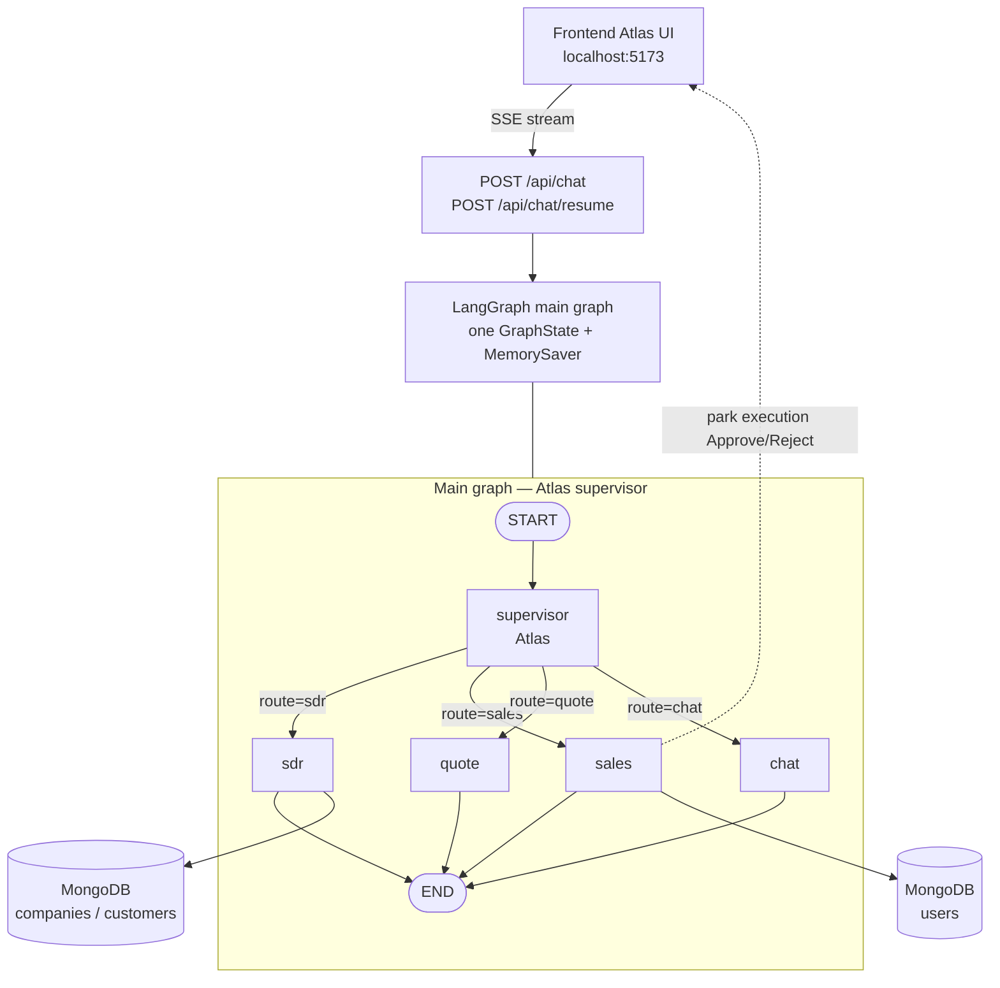
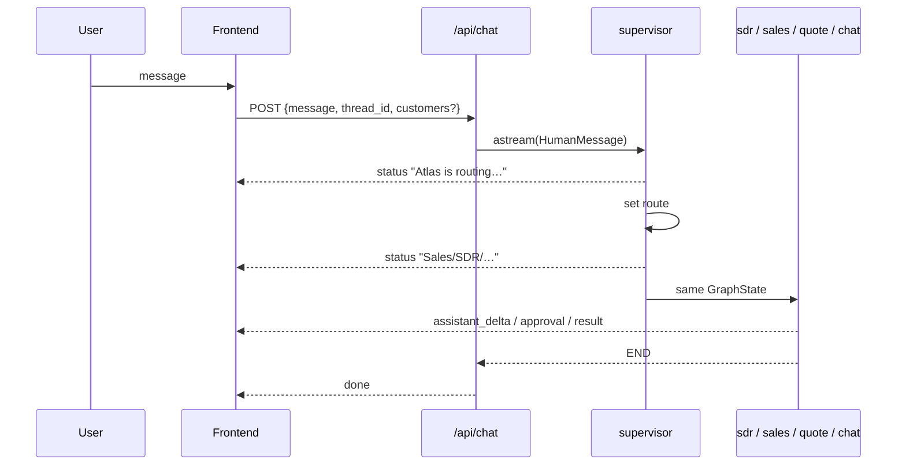
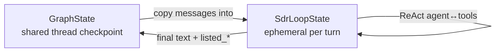
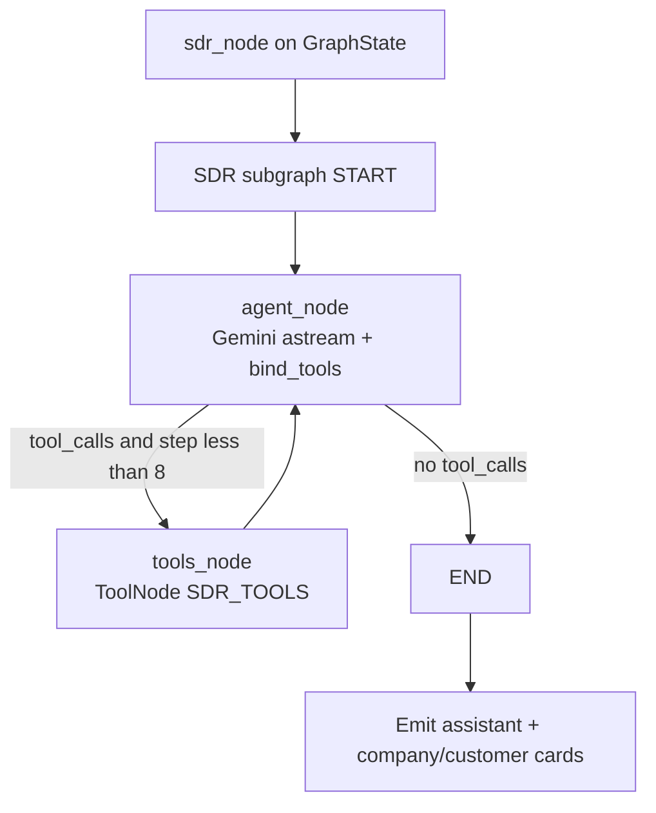
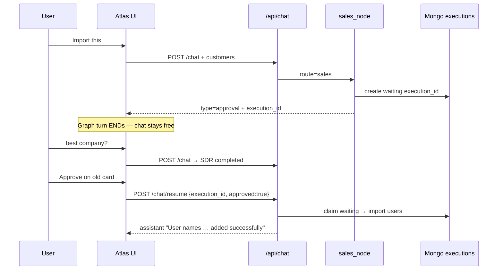

# Atlas Multi-Agent Architecture (CRM-Agent-POC)

This document explains how the **Atlas** multi-agent system works end-to-end: routing, SDR ReAct loop, Sales **multi-execution** human-in-the-loop, shared state, and exactly what context each LLM call receives.

---

## 1. Big picture



| Role | Name in product | Code |
|------|-----------------|------|
| Supervisor | **Atlas** | [`backend/app/agents/supervisor/`](backend/app/agents/supervisor/) |
| Discovery specialist | **SDR** | [`backend/app/agents/sdr/`](backend/app/agents/sdr/) |
| CRM import/delete + HITL | **Sales** | [`backend/app/agents/sales/`](backend/app/agents/sales/) |
| Quotes | Quote | [`backend/app/agents/quote/`](backend/app/agents/quote/) |
| Simple CRM lookup / small talk | Chat | [`backend/app/agents/chat_node.py`](backend/app/agents/chat_node.py) |

HTTP entry: [`backend/app/api/chat.py`](backend/app/api/chat.py) → `get_graph()` from [`backend/app/agents/graph.py`](backend/app/agents/graph.py).

---

## 2. Main graph wiring (Atlas navigates to specialists)

```18:42:backend/app/agents/graph.py
def build_graph():
    builder = StateGraph(GraphState)
    builder.add_node("supervisor", supervisor_node)
    builder.add_node("sales", sales_node)
    builder.add_node("quote", quote_node)
    builder.add_node("chat", chat_node)
    builder.add_node("sdr", sdr_node)

    builder.add_edge(START, "supervisor")
    builder.add_conditional_edges(
        "supervisor",
        _route,
        {
            "sales": "sales",
            "quote": "quote",
            "chat": "chat",
            "sdr": "sdr",
        },
    )
    builder.add_edge("sales", END)
    builder.add_edge("quote", END)
    builder.add_edge("chat", END)
    builder.add_edge("sdr", END)

    return builder.compile(checkpointer=MemorySaver())
```

**Every user turn:**

1. `START` → `supervisor` (Atlas)
2. Supervisor sets `state["route"]`
3. Conditional edge `_route` sends the turn to **one** specialist
4. Specialist finishes → `END`
5. Next user message starts again at `supervisor` (same `thread_id` checkpoint)



### Atlas routing order (important)

Implemented in [`backend/app/agents/supervisor/agent.py`](backend/app/agents/supervisor/agent.py):

| Priority | Rule | Example |
|----------|------|---------|
| 0 | Import / delete → **sales** (always before sticky SDR) | `Import this customers to atlas` |
| 1 | Cancel open work → chat | `cancel` |
| 2 | Sticky incomplete quote | user filling quote fields |
| 3 | Sticky incomplete sales draft | missing name/email |
| 4 | Sticky SDR discovery | company locked / lists present |
| 5 | Regex ladder, else LLM fallback | last **8** messages + system prompt |

```46:55:backend/app/agents/supervisor/agent.py
    # 0) Import / delete ALWAYS wins — before sticky SDR discovery
    #    ("Import this customers…" must never stay on the SDR agent.)
    if is_sales_intent(latest) or looks_like_import(latest):
        route = "sales"
        emit_status(writer, ROUTE_STATUS[route])
        update["route"] = route
        if state.get("created_user"):
            update["created_user"] = None
            update["extracted_user"] = None
        return update
```

Intent helpers: [`backend/app/agents/supervisor/intent.py`](backend/app/agents/supervisor/intent.py).  
Supervisor system prompt: [`backend/app/agents/supervisor/prompts.py`](backend/app/agents/supervisor/prompts.py).

---

## 3. Shared state (one graph state for all agents)

### Same state — not per-agent copies

All specialists read/write the **same** `GraphState` for a given `thread_id`.

```6:19:backend/app/agents/state.py
class GraphState(TypedDict):
    messages: Annotated[list, add_messages]
    route: Literal["sales", "quote", "chat", "sdr"] | None
    extracted_user: dict[str, Any] | None
    created_user: dict[str, Any] | None
    extracted_quote: dict[str, Any] | None
    created_quote: dict[str, Any] | None
    listed_quotes: list[dict[str, Any]] | None
    # SDR discovery
    locked_company_id: str | None
    listed_companies: list[dict[str, Any]] | None
    listed_customers: list[dict[str, Any]] | None
    # Sales HITL
    pending_approval: dict[str, Any] | None
```

| Field | Who writes | Who reads |
|-------|------------|-----------|
| `messages` | All agents (via `add_messages`) | All agents + supervisor |
| `route` | Supervisor | Graph router |
| `locked_company_id`, `listed_companies`, `listed_customers` | SDR (and FE re-send on import) | SDR sticky + Sales import |
| `extracted_user` / `created_user` | Sales | Sales sticky / UI |
| `extracted_quote` / `created_quote` / `listed_quotes` | Quote | Quote sticky / UI |

**Checkpoint:** `MemorySaver()` keyed by `configurable.thread_id` (in-memory; lost on process restart).

**Durable chat transcript (separate from LangGraph state):** Mongo `conversations` via [`backend/app/db/conversations_repo.py`](backend/app/db/conversations_repo.py).

### SDR also has a *private* subgraph state

Only inside the ReAct loop:

```55:60:backend/app/agents/sdr/agent.py
class SdrLoopState(TypedDict):
    messages: Annotated[list, add_messages]
    step_count: int
```

- Built from parent `GraphState.messages` for one turn  
- Tool messages live here during the loop  
- Parent only gets back the final assistant text + discovery fields (`listed_*`, `locked_company_id`)



---

## 4. SDR agent — ReAct tool loop

### Folder

```
backend/app/agents/sdr/
  agent.py      # ReAct subgraph + sdr_node
  tools.py      # search_companies, get_company_details, search_customers
  prompts.py    # SDR_SYSTEM
  schema.py
```

### Flow



### Loop code

**Cap:** `MAX_SDR_STEPS = 8` in [`sdr/agent.py`](backend/app/agents/sdr/agent.py).

**Agent step** — system prompt + **full turn history** from `SdrLoopState.messages` (grows with tool results):

```97:97:backend/app/agents/sdr/agent.py
    async for chunk in llm.astream([SystemMessage(content=SDR_SYSTEM), *history]):
```

**Router:**

```python
# should_continue → "tools" if last AIMessage has tool_calls else END
```

**Tools** ([`sdr/tools.py`](backend/app/agents/sdr/tools.py)):

| Tool | Purpose |
|------|---------|
| `search_companies` | Region / HS / role / keywords → Mongo |
| `get_company_details` | Full profile by `companyId` |
| `search_customers` | Contacts for locked company |

**Outer node** streams nested custom events to SSE and preserves discovery lists (does not wipe with `None` on prose-only turns).

Example user path:

1. `Find buyers in India for motorcycles` → tools → company cards  
2. `CMP002` / click row → profile  
3. `Show customers` → customer cards  
4. `Import this` → **leaves SDR** (supervisor priority 0) → Sales  

---

## 5. Sales agent — multi-execution HITL

### Why not LangGraph `interrupt()`?

With a single graph checkpoint per `thread_id`, `interrupt()` **owns the whole conversation**. If the user ignores Approve and asks something else (`best company?`), the next `/api/chat` turn moves the checkpoint forward and the old Approve button stops working.

**Fix:** park each Sales plan as its own durable **execution**. The graph turn **ends** after showing the card. Later Approve targets `execution_id`, not “whatever the thread last did.”

### Mental model

```
Conversation (thread_id)
  ├── execution-001 → sales  → waiting   (Approve later OK)
  ├── execution-002 → sdr    → completed
  └── execution-003 → quote  → running / completed
```

| Concept | What it is |
|---------|------------|
| `thread_id` | One Atlas chat / conversation |
| `execution_id` | One Sales import/delete plan waiting for a human |
| Graph turn | One `/api/chat` message → supervisor → one specialist → END |
| Approve | `/api/chat/resume` with that `execution_id` — **does not** re-run LangGraph |

### How it works (step by step)

1. User: `Import this` (FE may re-send last customer cards).
2. Atlas routes to **sales**.
3. Sales builds the candidate list (from `listed_customers` or typed fields).
4. Sales calls `_park_approval`:
   - inserts Mongo doc in `executions` with `status: "waiting"`
   - emits SSE `approval` including `execution_id`
   - emits assistant text (“Approve when ready — you can keep chatting”)
   - **returns** → graph **END** (thread is free)
5. User can ask SDR / Quote / anything else — new `/api/chat` turns.
6. User clicks **Approve** on the old card.
7. FE calls `POST /api/chat/resume` with `{ thread_id, execution_id, approved }`.
8. Backend `claim_waiting` (atomic) → import or delete → mark `completed` / `rejected`.
9. SSE streams status + success message (e.g. names added → Customers tab).

### Folder

```
backend/app/agents/sales/
  agent.py      # build plan + park execution (_park_approval)
  execute.py    # Approve/Reject applies parked plan
  tools.py      # create / delete / find users
  prompts.py    # SALES_SYSTEM
  schema.py     # SalesExtract
backend/app/db/executions_repo.py   # Mongo executions collection
```

### Execution document (Mongo `executions`)

| Field | Meaning |
|-------|---------|
| `execution_id` | UUID — what the Approve button sends back |
| `thread_id` | Conversation that owns this plan |
| `agent` | `"sales"` |
| `action` | `"import"` or `"delete"` |
| `message` | Card title text |
| `users` | Snapshot of contacts to import/delete (copied at park time) |
| `status` | `waiting` → `resolving` → `completed` / `rejected` |
| `result_text` | Final assistant line after resolve |
| `created_at` / `resolved_at` | Timestamps |

Code: [`backend/app/db/executions_repo.py`](backend/app/db/executions_repo.py)

### Status / idempotency

```
waiting  --claim-->  resolving  --success-->  completed
                         |
                         +--reject-->  rejected
                         |
                         +--crash-->  waiting again (release_claim)
```

- Double-click Approve: second call finds non-`waiting` → returns prior result or a clear error.
- Wrong thread / missing id → error SSE, card can be retried only if still `waiting`.

### Chat + UI flow



### API contracts

**Park (during normal chat SSE)**

```json
{
  "type": "approval",
  "approval": {
    "execution_id": "uuid",
    "action": "import",
    "message": "Import 3 contact(s) into Atlas Customers?",
    "users": [{ "name": "…", "email": "…" }]
  }
}
```

**Resolve**

```http
POST /api/chat/resume
{
  "thread_id": "…",
  "execution_id": "uuid",
  "approved": true
}
```

### Code reference

| Step | Location |
|------|----------|
| Park plan + emit card | [`sales/agent.py`](backend/app/agents/sales/agent.py) `_park_approval` |
| Apply Approve/Reject | [`sales/execute.py`](backend/app/agents/sales/execute.py) `resolve_sales_execution` |
| Resume HTTP | [`api/chat.py`](backend/app/api/chat.py) `POST /chat/resume` |
| FE click handler | [`AtlasChatPage.tsx`](frontend/src/pages/AtlasChatPage.tsx) `decideApproval` |
| FE API | [`api/chat.ts`](frontend/src/api/chat.ts) `resumeChat(..., executionId)` |
| Card UI | [`ApprovalCard.tsx`](frontend/src/components/chat/ApprovalCard.tsx) |

Park helper (concept):

```python
# sales/agent.py — _park_approval
doc = await executions_repo.create_waiting(
    thread_id=thread_id, agent="sales",
    action=action, message=message, users=users,
)
emit_approval(writer, executions_repo.to_approval_payload(doc))
# graph returns → END (no interrupt)
```

Resolve (concept):

```python
# sales/execute.py
claimed = await executions_repo.claim_waiting(execution_id, thread_id)
# if approved → create_user_record / delete_user_by_id
# mark completed | rejected
```

### Why FE sends `customers` on import

If a prior route wiped graph lists, the UI still has the cards. On messages matching `import`, AtlasChatPage re-sends `customers` / `companies`; `chat.py` merges them into `graph_input["listed_customers"]`. The parked execution **copies** those users into Mongo, so Approve later does not need live `GraphState`.

### Expected UX

| User action | Result |
|-------------|--------|
| Import → Approve immediately | Import runs |
| Import → ask SDR → Approve old card | Import still runs (execution parked) |
| Import → Reject | Cancel message; nothing saved |
| Approve twice | Second click is no-op / “already handled” |
| Old card without `execution_id` | FE asks to import/delete again |

---

## 6. LLM context budget (what each call sees)

| Agent | System prompt file | Messages sent to LLM | Notes |
|-------|--------------------|----------------------|--------|
| **Atlas supervisor** (LLM fallback only) | [`supervisor/prompts.py`](backend/app/agents/supervisor/prompts.py) `SUPERVISOR_SYSTEM` | **Last 8** `state.messages` | Most turns use regex only — **no LLM** |
| **SDR** (each ReAct step) | [`sdr/prompts.py`](backend/app/agents/sdr/prompts.py) `SDR_SYSTEM` | **`[System] + full SdrLoopState.messages`** | Includes tool results for that turn; max **8** agent↔tool cycles |
| **Sales** | [`sales/prompts.py`](backend/app/agents/sales/prompts.py) `SALES_SYSTEM` + injected `listed_customers` / `extracted_user` | **Last 10** messages | Structured output `SalesExtract` |
| **Quote** | [`quote/prompts.py`](backend/app/agents/quote/prompts.py) | **Last 10** | Structured extract |
| **Chat** | inline `CHAT_SYSTEM` in [`chat_node.py`](backend/app/agents/chat_node.py) | **Last 8** | Streaming `astream` |

### Supervisor fallback (only when regex does not decide)

```117:120:backend/app/agents/supervisor/agent.py
        llm = get_llm().with_structured_output(RouteDecision)
        history = state.get("messages") or []
        recent = history[-8:] or [HumanMessage(content="hello")]
        decision = await llm.ainvoke([SystemMessage(content=SUPERVISOR_SYSTEM), *recent])
```

### Sales extract call

```199:210:backend/app/agents/sales/agent.py
    extract: SalesExtract = await llm.ainvoke(
        [
            SystemMessage(
                content=(
                    f"{SALES_SYSTEM}\n\n"
                    f"Listed Atlas customers in state: "
                    f"{state.get('listed_customers') or 'none'}.\n"
                    f"Fields already collected: {state.get('extracted_user') or 'none'}."
                )
            ),
            *history[-10:],
        ]
    )
```

### SDR ReAct call (every loop iteration)

```text
[ SystemMessage(SDR_SYSTEM) ]
[ ... all messages in SdrLoopState so far:
    prior chat Human/AI,
    optional lock SystemMessage,
    AIMessage(tool_calls),
    ToolMessage(results),
    ... ]
```

---

## 7. SSE event types (UI contract)

Emitted via [`backend/app/agents/streaming.py`](backend/app/agents/streaming.py):

| `type` | Meaning |
|--------|---------|
| `status` | Atlas / specialist progress line |
| `assistant_delta` | Live Gemini token |
| `assistant` | Final text for the turn |
| `approval` | HITL card payload (`execution_id`, `action`, `users`) |
| `result` | user / companies / customers cards |
| `quotes` | Quote table |
| `done` / `error` | Stream end |

---

## 8. Folder map

```
CRM-Agent-POC/
├── ARCHITECTURE.md          ← this file
├── backend/app/
│   ├── api/chat.py          # /chat + /chat/resume (execution_id) SSE
│   ├── agents/
│   │   ├── graph.py         # Atlas main graph
│   │   ├── state.py         # shared GraphState
│   │   ├── supervisor/      # Atlas router
│   │   ├── sdr/             # discovery ReAct loop
│   │   ├── sales/           # import/delete + park execution HITL
│   │   ├── quote/
│   │   └── chat_node.py
│   ├── db/                  # Mongo repos (+ executions_repo)
│   └── services/company_search.py
└── frontend/src/
    ├── pages/AtlasChatPage.tsx
    └── components/chat/ApprovalCard.tsx
```

---

## 9. Quick mental model

1. **One thread → one shared `GraphState`** (checkpointed) + Mongo conversation log.  
2. **Atlas** only routes; specialists do the work.  
3. **SDR** = nested ReAct tool loop for discovery.  
4. **Sales** = plan → park Mongo `execution_id` → Approve anytime (other agents can run in between).  
5. **Import always beats sticky SDR** so discovery cannot fake an import.  
6. **Approve = `/chat/resume` + `execution_id`**, not LangGraph `Command(resume)`.

---

## 10. Try it

```bash
# backend
cd CRM-Agent-POC/backend && source .venv/bin/activate
python -m scripts.seed_atlas_data
uvicorn app.main:app --reload --port 8000

# frontend
cd CRM-Agent-POC/frontend && npm run dev
```

**Happy path**

1. `Find buyers in India for motorcycles` → pick company → `Show customers`  
2. `Import this` → **Approve**  
3. Customers tab → **Today / Recent**

**Multi-execution (Approve later)**

1. `Import this` → leave the Approve card  
2. `give the best company in the list` → SDR answers  
3. Click **Approve** on the earlier card → import still succeeds  
4. Customers tab shows the new names
